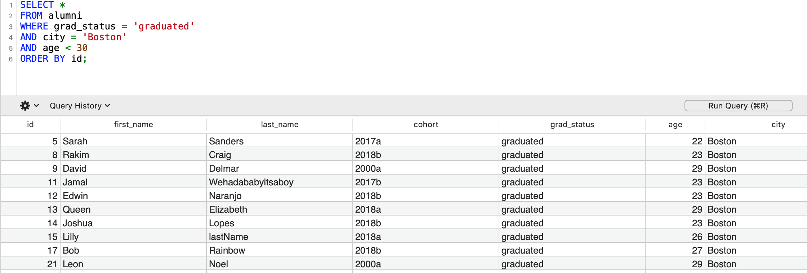

# 🔢 Week02 Alumni Project: PostgreSQL Query

### Goal: Build a Simple DB and submit a photo of the results of a complicated query

### What it should look like:

At least 20 students in your database. The query should return all students who graduated, live in Boston, and are under 30 in ascending order based on id.

| id    | first_name     | last_name   | cohort | grad status | age | city | state | neighborhood |
| ---------|:-------------:|:-------------:|:------:|:------:|:------:|:------:|:------:| ------:|
|   05  | Sarah | Sanders | 2017a | graduated | 22 | Boston | MA | JP |
|   11  | Jamal | Wehadababyitsaboy | 2017b | graduated | 23 | Boston | MA | Roxbury |
|   13  | Queen | Elizabeth | 2018a | graduated | 29 | Boston | MA | Dorchester |
|   17  | Bob | Rainbow | 2018b | graduated | 27 | Boston | MA | Dorchester |



```
I completed the challenge: 5
I feel good about my code: 4
I'm not sure if I am running to many conditionals and if the order of the conditinals matter.
```
